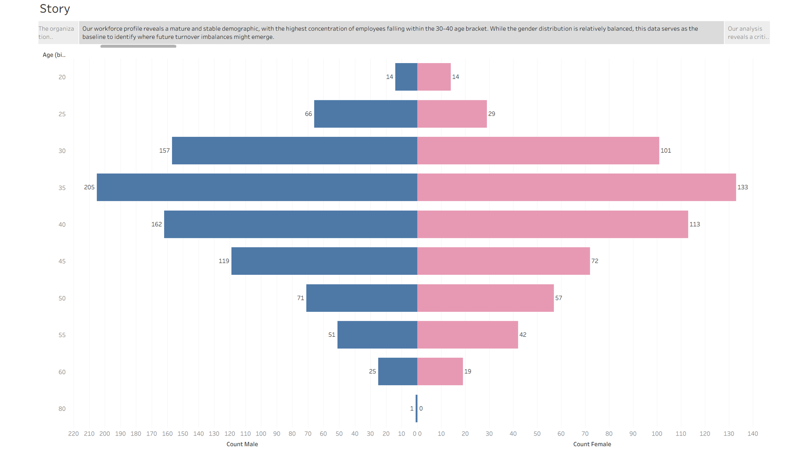
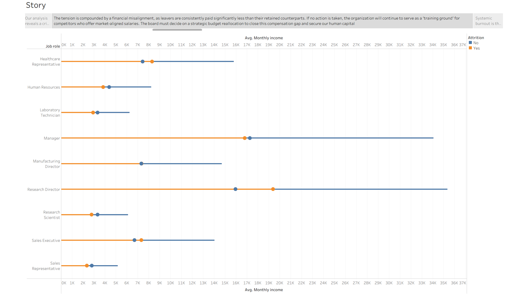
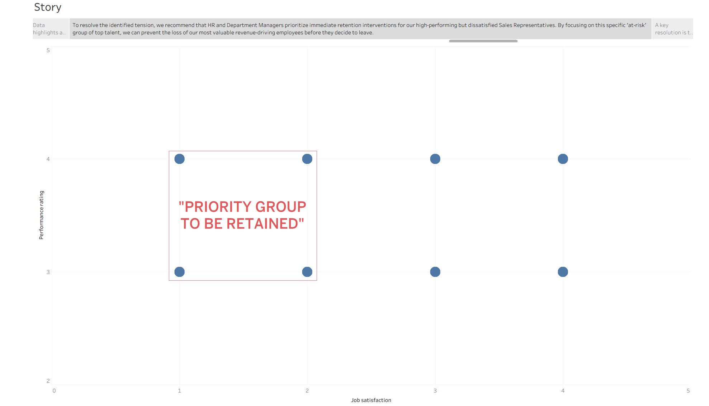

# Employee Attrition Analytics: Diagnosing and Predicting Turnover

**End-to-end HR analytics project on ~1,450 employees: descriptive dashboards in Tableau, a predictive pipeline in KNIME, and a business report with costed recommendations.**

Losing staff is expensive and, in a specialised workforce, a strategic risk. This project first diagnoses *where* and *why* attrition is happening, then builds a model to flag at-risk employees before they leave, so HR can intervene early and spend retention budget where it counts.

---

## Business problem

A pharmaceutical company is losing talent unevenly across the organisation, and reactive replacement is costly. The task was twofold: use visual analytics to expose the structural drivers of attrition, then build a predictive tool to identify high-risk employees in advance, turning a backward-looking HR report into a forward-looking decision-support system.

## Approach

The project follows the CRISP-DM framework across three deliverables:

- **Diagnose (Tableau):** cleaned the raw file from 1,455 records to 1,451 validated entries in Tableau Prep (removed impossible ages and tenures, standardised inconsistent categories), then built a storyboard of dashboards to surface the tensions behind attrition.
- **Predict (KNIME):** built a classification pipeline (Excel Reader, feature selection, stratified 70/30 partition, Decision Tree and Random Forest learners, Scorer and ROC evaluation) to flag likely leavers and rank the factors that drive them.
- **Recommend (report):** translated both into costed, theory-grounded retention actions for HR and department managers.
- **Tools:** Tableau Prep and Desktop, KNIME Analytics Platform.

## Key findings

- **Attrition is structural, not random.** It concentrates in specific pockets rather than spreading evenly.
- **Sales is in crisis:** attrition in the department approaches 40%, risking a loss of experienced staff faster than they can be replaced.
- **Pay gaps drive exits:** leavers are consistently paid less than retained peers in the same roles, most sharply for Sales Representatives and Laboratory Technicians.
- **Overtime predicts burnout:** employees working overtime leave at roughly twice the rate, and overtime was the single most influential factor in the predictive model.
- **Equity and distance matter:** attrition is about three times higher among employees with zero stock options, and leavers live noticeably further from the workplace.
- **The predictive model** reached ~83% accuracy with an AUC of 0.67, deliberately conservative to avoid costly false alarms, and isolated a high-risk group for targeted "stay interviews."

## Why this is relevant beyond HR

This is a full analytics lifecycle: clean messy operational data, diagnose a problem visually, build and evaluate a predictive model, and convert it into resource-allocation decisions. The same pattern (segment a population, rank risk drivers, target limited resources where ROI is highest) applies directly to operations and supply chain problems such as supplier risk, churn, and demand prioritisation.

## Visuals

*The workforce baseline: a stable, mature demographic concentrated in the 30 to 40 bracket.*

*Leavers (orange) are consistently paid less than stayers (blue) in the same roles, a core driver of attrition.*

*High-performing but dissatisfied employees, the priority group for targeted retention.*

## Repository contents

| File | Description |
|------|-------------|
| `HR_Attrition_Analytics_Report.pdf` | Full report: methodology, diagnosis, predictive modelling, and recommendations |
| `HR_Tableau_Storyboard.pdf` | The full Tableau storyboard of dashboards |
| `age_gender_pyramid.png` / `pay_gap_by_role.png` / `priority_retention_group.png` | Key dashboard visuals |

## Notes on data and reproducibility

> *The employee dataset is not shared, as it contains personal HR records provided for coursework. The KNIME workflow file is also not published because it caches that employee data inside the saved nodes; the pipeline is instead documented in the report and dashboards. The methodology is fully reproducible with any comparable HR attrition dataset.*
